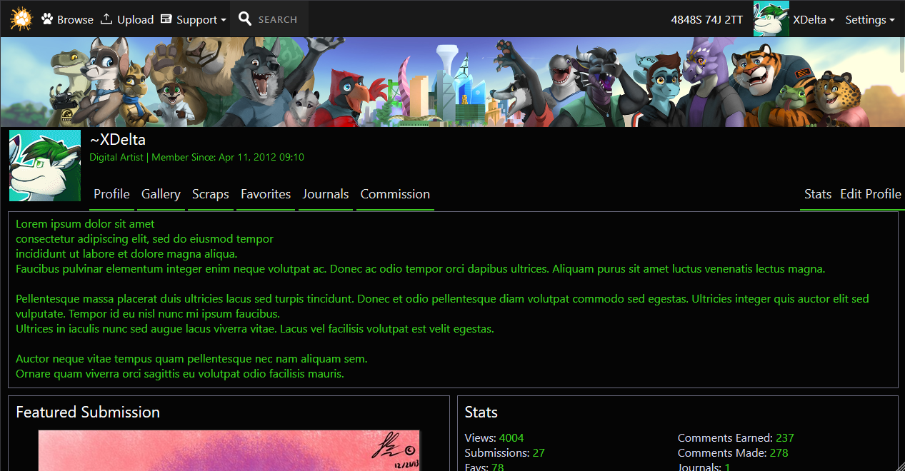
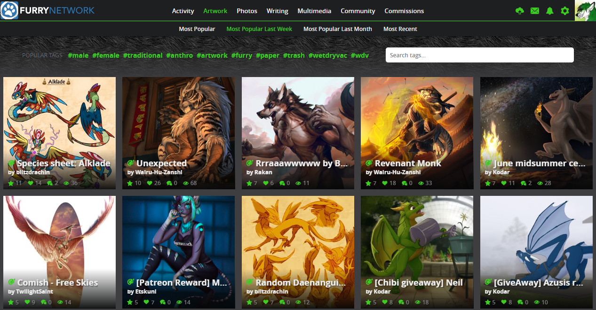
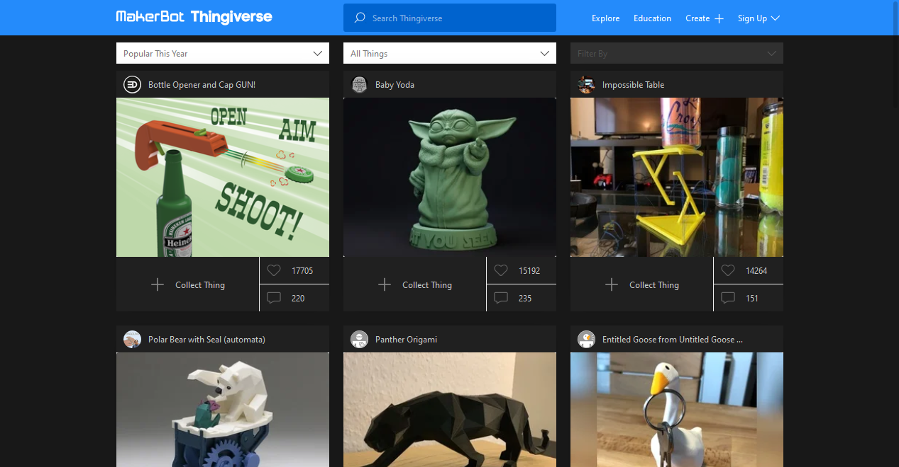
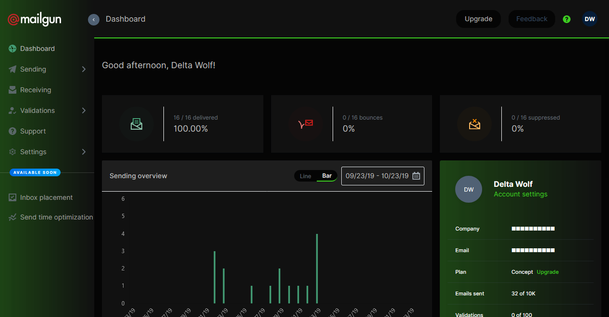

# StylusUserCSS
Collection of my usercss files for Stylus.

## Requirements
+ [Stylus](https://add0n.com/stylus.html) or similar usercss extension
+ Decently up to date browser

## Installation

Install [Stylus](https://add0n.com/stylus.html) for either [Firefox](https://addons.mozilla.org/en-US/firefox/addon/styl-us/), [Chrome](https://chrome.google.com/webstore/detail/stylus/clngdbkpkpeebahjckkjfobafhncgmne) or [Opera](https://addons.opera.com/en-gb/extensions/details/stylus/) and then install the style you would like to use below:

### [Fur Affinity Dark]

[Install the usercss](https://github.com/XDelta/StylusUserCSS/raw/master/fa-dark.user.css) with automatic updates.* 
[Install manually from GitHub](https://github.com/XDelta/StylusUserCSS/raw/master/fa-dark.css) for manual customization. 

### [Furry Network Accents]

[Install the usercss](https://github.com/XDelta/StylusUserCSS/raw/master/fn-accents.user.css) with automatic updates.* 
[Install manually from GitHub](https://github.com/XDelta/StylusUserCSS/raw/master/fn-accents.css) for manual customization. 

### [Thingiverse Dark]

[Install the usercss](https://github.com/XDelta/StylusUserCSS/raw/master/thingiverse-dark.user.css) with automatic updates.* 
[Install manually from GitHub](https://github.com/XDelta/StylusUserCSS/raw/master/thingiverse-dark.css) for manual customization. 

### [Mailgun Dark]

[Install the usercss](https://github.com/XDelta/StylusUserCSS/raw/master/mailgun-dark.user.css) with automatic updates.* 
[Install manually from GitHub](https://github.com/XDelta/StylusUserCSS/raw/master/mailgun-dark.css) for manual customization. 

### [Hyperpolyglot Simple Dark]
No screenshot, just on dark color instead of white.
[Install the usercss](https://github.com/XDelta/StylusUserCSS/raw/master/hyperpolyglot-simple-dark.user.css) with automatic updates.* 
[Install manually from GitHub](https://github.com/XDelta/StylusUserCSS/raw/master/hyperpolyglot-simple-dark.css) for manual customization. 

### [Torn City Stealth Meter Tweak]
Makes the stealth meter when attacking in torn city more visible. 
[Install the usercss](https://github.com/XDelta/StylusUserCSS/raw/master/torn-city-stealth-meter-tweak.user.css) with automatic updates.* 
[Install manually from GitHub](https://github.com/XDelta/StylusUserCSS/raw/master/torn-city-stealth-meter-tweak.css) for manual customization. 

*Automatic updates from stylus plugin, other loaders may vary.
